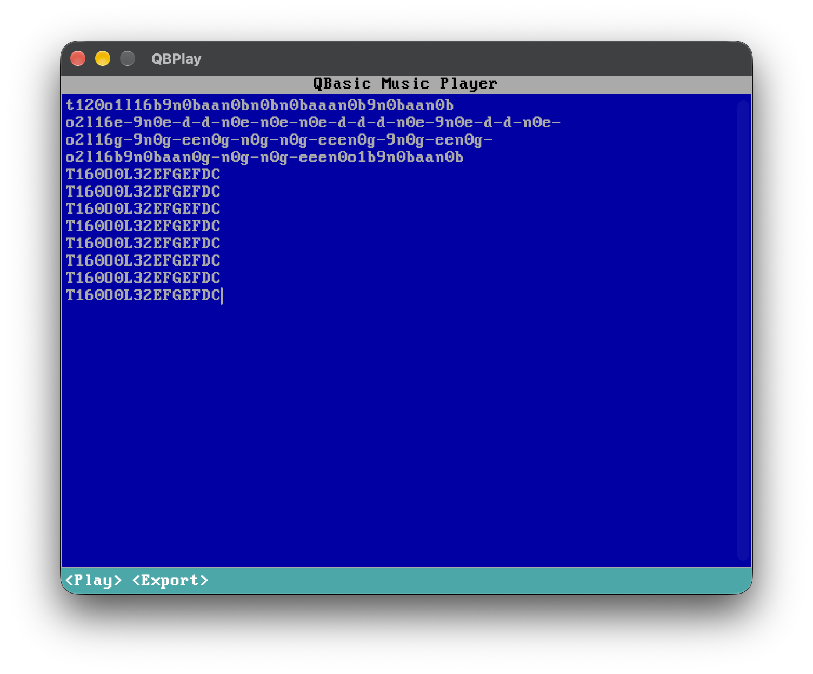

# QBPlay

QBPlay is a native macOS application that interprets a subset of the classic QBasic `PLAY` music macro language and renders it as synthesized audio.

The app combines a deliberately retro QBasic-inspired interface with a modern Swift audio pipeline. Enter a `PLAY`-style tune, listen to it immediately, and export the rendered result as a WAV file.

## Demo


🔊 [Listen to the sample generated by QBPlay](doc/sounds/gorillas_theme.wav)

## Features

- Native macOS application built with SwiftUI
- QBasic-inspired VGA interface and typography
- Parses a useful subset of QBasic `PLAY` / Music Macro Language (MML)
- Supports named notes and numbered notes
- Supports sharps, flats, dotted durations, rests, tempo, octave, and default note length
- Supports legato, normal, and staccato articulation
- Accepts QBasic `MB` and `MF` mode commands for compatibility, although they do not affect playback
- Synthesizes audio locally using `AVAudioEngine` and Apple Accelerate
- Produces a square-like waveform with short attack/release envelopes to reduce clicks
- Preserves phase continuity between legato notes
- Renders mono audio at 48 kHz
- Exports rendered music as WAV
- No third-party package dependencies in the current implementation

## Supported PLAY Syntax

QBPlay currently implements the following commands.

| Command | Meaning | Example |
| --- | --- | --- |
| `A`-`G` | Play a named note | `C D E F G` |
| `#` or `+` | Sharp accidental | `C#` or `C+` |
| `-` | Flat accidental | `B-` |
| `L1`-`L64` | Set the default note length | `L8` |
| `M L` | Legato articulation | `ML` |
| `M N` | Normal articulation | `MN` |
| `M S` | Staccato articulation | `MS` |
| `M B` | QBasic background mode; accepted and ignored | `MB` |
| `M F` | QBasic foreground mode; accepted and ignored | `MF` |
| `N0`-`N84` | Play a numbered note; `N0` is a rest | `N40` |
| `O0`-`O6` | Set the QBasic octave | `O4` |
| `<` | Shift down one octave | `<C` |
| `>` | Shift up one octave | `>C` |
| `P1`-`P64` | Rest for the specified note length | `P4` |
| `T32`-`T255` | Set tempo in quarter notes per minute | `T120` |
| `.` | Add a duration dot to a note or rest | `C4.` |

Commands are case-insensitive, and whitespace is ignored.

### Note lengths

Note lengths use the traditional reciprocal notation:

- `1` = whole note
- `2` = half note
- `4` = quarter note
- `8` = eighth note
- `16` = sixteenth note

QBPlay accepts integer note-length values from `1` through `64`.

A named note can override the current default length directly:

```text
L4 C D E8 F8 G2
```

Dots extend a note or rest using conventional dotted-note timing:

```text
C4. D8.. P4.
```

### Articulation

The supported articulation modes are:

- `MS` — staccato; note sounds for 75% of its nominal duration
- `MN` — normal; note sounds for 87.5% of its nominal duration
- `ML` — legato; note sounds for its full nominal duration

For legato passages, QBPlay preserves oscillator phase between connected notes to produce smoother transitions.

### QBasic octave mapping

QBPlay preserves QBasic's octave numbering rather than exposing scientific pitch notation directly. Internally, QBasic octave values are shifted by two octaves to align the synthesizer with standard A4 = 440 Hz tuning.

## Example

Paste the following into the editor:

```text
T120 O4 L4 MN
C C G G A A G2
F F E E D D C2
```

Press **Command-R** to play or stop the tune.

## Keyboard Shortcuts

| Shortcut | Action |
| --- | --- |
| `Command-R` | Play / Stop |
| `Command-E` | Export WAV |

## Audio Generation

QBPlay uses a simple synthesis pipeline rather than MIDI playback or prerecorded samples.

1. `MMLLexer` converts the input string into `MMLCommand` values.
2. `MMLInterpreter` converts those commands into `Note` and `Rest` events while maintaining tempo, octave, articulation, and default-length state.
3. `MusicEventRenderer` generates audio samples for each event.
4. A sine wave is shaped with `tanh` into a square-like tone and scaled to a conservative output level.
5. Short attack and release envelopes reduce discontinuities and audible clicks.
6. `AudioBufferRenderer` copies the samples into an `AVAudioPCMBuffer`.
7. `AudioPlayer` plays the buffer through `AVAudioEngine`.

The current audio format is mono, 48 kHz floating-point PCM.

## WAV Export

Choose **Command-E** to render the current tune and save it as a `.wav` file.

Export uses the same rendering path as live playback, so the exported file should match what you hear in the application.

## Requirements

The current source uses modern SwiftUI, Observation, AVFoundation, and Accelerate APIs.

Recommended development environment:

- macOS 26.2 Tahoe or later
- Xcode 26 or later
- Swift 5.9 or later

## Building

Clone the repository:

```bash
git clone https://github.com/foxrunlabs/qbplay.git
cd qbplay
```

Open the Xcode project:

```bash
open qbplay.xcodeproj
```

Select the QBPlay macOS target and run the project from Xcode.

## Current Scope

QBPlay is intended to reproduce the musical portion of QBasic `PLAY`, not to emulate QBasic itself.

The current implementation does **not** attempt to support every historical `PLAY` feature. In particular, commands outside the syntax documented above are rejected as invalid input. `MB` and `MF`, which controlled background and foreground execution in QBasic, are parsed for compatibility but have no effect in a modern standalone audio renderer.

Playback is synthesized as a single monophonic stream; chords and simultaneous voices are not currently represented by the parser or event model.

## Design Notes

The application intentionally separates parsing from audio generation:

- MML syntax is represented independently of playback.
- Interpreter state is isolated from the audio renderer.
- Music events contain musical timing rather than sample-level details.
- Rendering is deterministic and can be reused for both playback and file export.

This keeps the codebase small while leaving room for additional commands, alternate waveforms, richer export formats, or expanded tests later.

## Contributing

Issues and pull requests are welcome. For changes to the MML implementation, please include examples that demonstrate the expected QBasic `PLAY` behavior where possible.

## License

QBPlay is available under the [MIT License](LICENSE).

Copyright © 2026 Ryan Clarke

VGA TTF font is available under the [Creative Commons Attribution-ShareAlike 4.0 International License](https://creativecommons.org/licenses/by-sa/4.0/).

Copyright © 2015-2020 VileR [The Ultimate Oldschool PC Font Pack](https://int10h.org/oldschool-pc-fonts/)

---

QBPlay is an independent project inspired by the music macro language and visual style of Microsoft QBasic. It is not affiliated with or endorsed by Microsoft.
